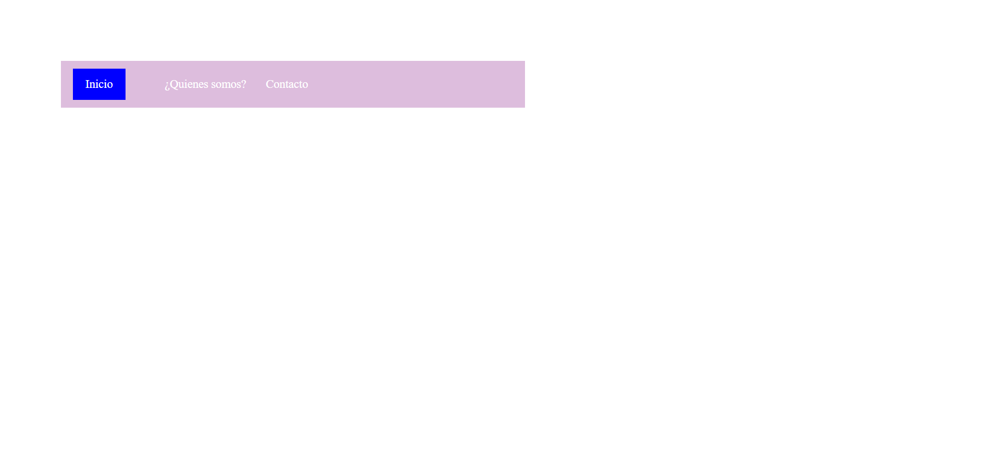

<h1>Taller 9 - Manuel Andres Jimenez Rodas</h1>

<h2>Información</h2>

Curso: Full Stack Basico - Grupo 1

Profesor: Cristian Patiño

<h2>Link de la pagina web</h2>
<a href="https://mael22jimenez.github.io/taller-9-fullstack/">Link pagina</a>

<h2>Punto 1: Link de figma</h2>
<a href="https://www.figma.com/file/sv94odnY6pKPwygx6GF5KO/Manuel-Andres-Jimenez-Rodas?type=design&node-id=0%3A1&mode=design&t=IyMShtKm6rIYI28A-1">Link de Figma</a>

<h2>Punto 2: Diseño en HTML</h2>

<h2>Punto 3: Diseño con CSS</h2>

<h2>Punto 4: Titulos</h2>

<h2>Punto 5: Párrafo</h2>

<h2>Punto 6: Links</h2>

<h2>Punto 7 y 8: Navegación</h2>

<h2>Punto 9: Tabla</h2>

